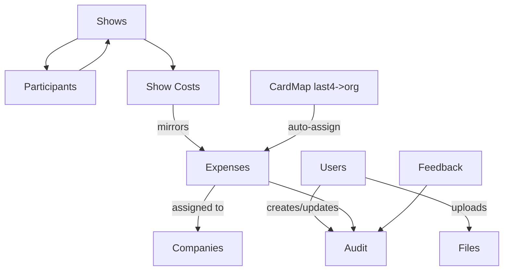

# Expensely

A lightweight trade-show expense management app.

## Quick start

```bash
# Install dependencies and build
cd web && npm ci && npm run build
cd ../api && npm ci

# Run with Docker
docker compose up -d --build
```

Web on http://localhost:3000, API on http://localhost:4000/health.

## Features
- Admin: users/RBAC, audit, orphaned receipts, feedback tickets
- Coordinator: shows, participants (flight/hotel/car), show expenses
- Accounting: assign/unassign, totals & close/reopen, CSV export, reports, card last4 mapping
- Upload: OCR assist for last4, daily vs show, image preview

## Stack
Next.js 14 + TypeScript + Tailwind (web), Express (api), JSON on disk in /data, Docker Compose.

## Build & Development

### Prerequisites
- Node.js 18+
- Docker & Docker Compose

### Local Development
```bash
# Install dependencies
cd web && npm ci
cd ../api && npm ci

# Type checking  
cd web && npx tsc --noEmit

# Build web app
cd web && npm run build

# Start development
cd web && npm run dev  # http://localhost:3000
cd api && npm start    # http://localhost:4000
```

### Production Deploy
```bash
# Build and start all services
docker compose up -d --build

# Health check
curl http://localhost:4000/api/health
```

## Data schema
Rendered schema (GitHub Mermaid) and PNG fallback.



If your viewer does not render Mermaid, see the PNG in `docs/schema.png` (auto-generated by CI from `docs/schema.mmd`).

## Versioning
Docker images tagged (e.g., v0.1.4). UI shows version from NEXT_PUBLIC_APP_VERSION.
