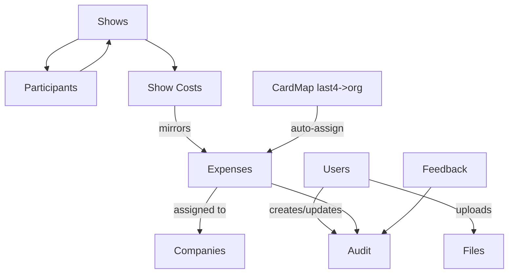

# Expensely

A lightweight trade-show expense management app.

## Features
- Admin: users/RBAC, audit, orphaned receipts, feedback tickets
- Coordinator: shows, participants (flight/hotel/car), show expenses
- Accounting: assign/unassign, totals & close/reopen, CSV export, reports, card last4 mapping
- Upload: OCR assist for last4, daily vs show, image preview

## Stack
Next.js + Tailwind (web), Express (api), JSON on disk in /data, Docker Compose.

## Quick start

Web on http://localhost, API on http://localhost:4000/health.

## Deploy
Use the provided docker-compose.yml. Set NEXT_PUBLIC_API_BASE_URL for web.

## Data schema
Rendered schema (GitHub Mermaid) and PNG fallback.

If your viewer does not render Mermaid, see the PNG in `docs/schema.png` (auto-generated by CI from `docs/schema.mmd`).

## Versioning
Docker images tagged (e.g., v0.1.4). UI shows version from NEXT_PUBLIC_APP_VERSION.
